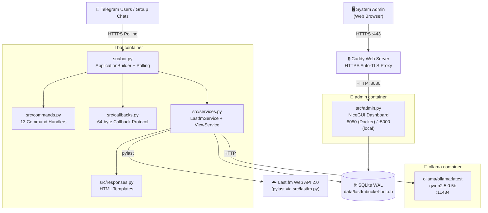
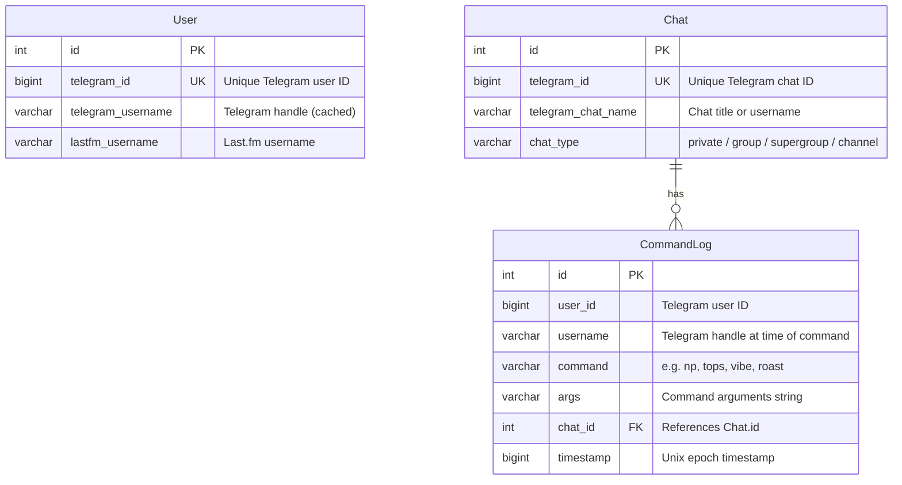
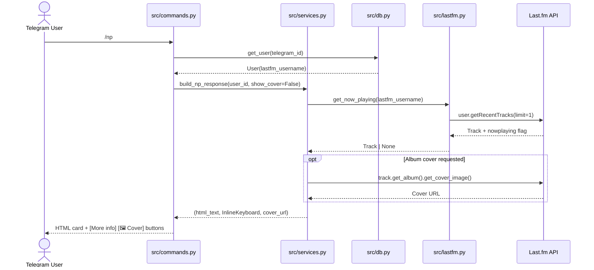
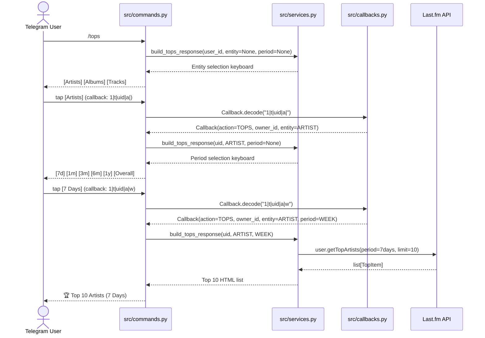
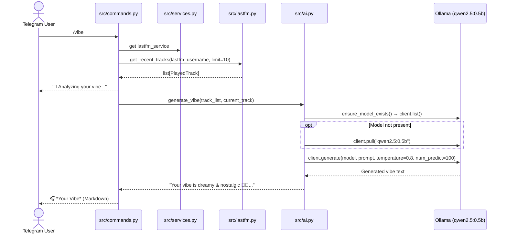
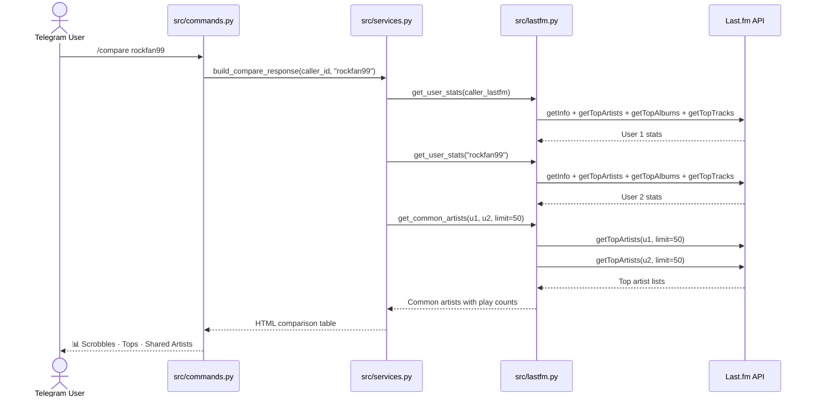

# System Architecture & Technical Specification

**Project:** `lastfmbucket-bot`  
**Repository:** `paurieraf/lastfmbucket-bot`  
**Language / Runtime:** Python >= 3.14  
**Primary Frameworks:** `python-telegram-bot` v22.5, `peewee` v3.18.3, `pylast` v7.0.0, `nicegui` >= 2.0.0, `ollama` >= 0.4.0  

> 📘 Related docs: [README.md](README.md) · [docs/PRODUCT_PRESENTATION.md](docs/PRODUCT_PRESENTATION.md) · [CHANGELOG.md](CHANGELOG.md)

---

## 1. System Overview & High-Level Architecture

`lastfmbucket-bot` is a dual-process Python application backed by SQLite and a local LLM daemon (Ollama). The system provides Last.fm music scrobble tracking, listening telemetry, interactive charts, user taste comparisons, and generative AI music insights directly inside Telegram chats, alongside a web-based administration panel.

### 1.1 High-Level Architecture Diagram



---

## 2. Component Deep Dives

### 2.1 Telegram Bot Engine

The bot engine is located in `src/bot.py`, `src/commands.py`, `src/callbacks.py`, `src/services.py`, and `src/responses.py`.

#### 1. Lifecycle & Dispatching
- **Framework:** `python-telegram-bot` v22.5 running in polling mode (`ApplicationBuilder().token(...).build()`, `app.run_polling()`).
- **Telemetry:** Initialized with Sentry SDK (`sentry_sdk.init(dsn=config.SENTRY_DSN, send_default_pii=True)`).
- **Dependency Injection:** `LastfmService` and `ViewService` instances are attached to `app.bot_data` during startup and accessed inside handler routines via `context.bot_data["view_service"]`.
- **Command Logging Middleware:** Commands are decorated with `@log_command(command_name)`. It records caller `user_id`, `username`, arguments `context.args`, and chat context (`chat_id`, `chat_type`, `chat_name`) to SQLite via `db.log_command()`.

#### 2. Complete Command Matrix (13 Commands)

| # | Command | Handler Function | Purpose & Execution Flow | Output Format |
|---|---|---|---|---|
| 1 | `/start` | `start` (`commands.py:139`) | Welcomes user; checks if user is linked in SQLite; prompts `/set` if missing. | Plain text (`string.Template`) |
| 2 | `/set` | `lastfm_username_set` (`commands.py:194`) | Links caller's Telegram ID to Last.fm username via `LastfmService.set_lastfm_username`. | HTML confirmation / error |
| 3 | `/np` | `now_playing` (`commands.py:151`) | Queries currently playing track; generates view with `More info` and `🖼️ Cover` buttons. | HTML + Inline Keyboard |
| 4 | `/status` | `status` (`commands.py:216`) | Shows recent 5 tracks with relative timestamps (`humanize`); includes `Less info` and `🖼️ Cover` buttons. | HTML + Inline Keyboard |
| 5 | `/tops` | `tops` (`commands.py:249`) | Multi-tier interactive top charts (Artist/Album/Track over 7d/1m/3m/6m/1y/overall) or direct args parser (`_parse_tops_args`). | HTML List (Top 10) or 2-Tier Keyboard |
| 6 | `/compare` | `compare` (`commands.py:399`) | Compares listening stats, scrobble count, top artists, and common artists between caller and target. | HTML summary table |
| 7 | `/preferences` | `preferences` (`commands.py:337`) | Displays user settings and account management inline actions. | HTML + `Unlink account` Button |
| 8 | `/help` | `help_command` (`commands.py:364`) | Fetches bot description dynamically from Telegram Bot API via `context.bot.get_my_description()`. | Plain text with emoji conversion |
| 9 | `/changelog` | `changelog` (`commands.py:375`) | Reads `CHANGELOG.md` file (truncated to 4000 characters). | HTML `<pre>` code block |
| 10 | `/privacy` | `privacy` (`commands.py:387`) | Displays GDPR and data privacy policy. | HTML formatted text |
| 11 | `/vibe` | `vibe` (`commands.py:420`) | Analyzes last 10 scrobbles + current track using Ollama (`generate_vibe`). | Markdown AI response |
| 12 | `/roast` | `roast` (`commands.py:451`) | Generates humorous critique of user's overall top 10 artists and top 5 tracks via Ollama (`generate_roast`). | Markdown AI response |
| 13 | `/recommend` | `recommend` (`commands.py:487`) | Generates 5 lesser-known artist recommendations from top 10 artists via Ollama (`generate_recommendations`). | Markdown AI response |

#### 3. Compact Callback Query Protocol (`src/callbacks.py`)
Telegram enforces a strict **64-byte payload limit** on `InlineKeyboardButton.callback_data`. `src/callbacks.py` implements a versioned, delimited protocol that packs state and owner identity into ~20 bytes:

$$\text{Callback Wire Format: } \texttt{v|action|owner\_id|entity|period}$$

- **Components:**
  - `v`: Protocol version (`"1"`).
  - `action`: Short action identifier from `Action` enum (`nl`, `nc`, `nm`, `pu`, `t`).
  - `owner_id`: Target Telegram user ID (`int`). **Critical**: In group chats, buttons retain the identity of the user who initiated the query, preventing group members from hijacking or mutating each other's views.
  - `entity`: Optional short code from `Entity` enum (`a` = Artist, `b` = Album, `t` = Track).
  - `period`: Optional short code from `Period` enum (`w` = 7 days, `1` = 1 month, `3` = 3 months, `6` = 6 months, `y` = 1 year, `o` = Overall).

- **Action Enum & Routing Table:**

| Action Enum | Code | Dispatched Function (`commands.py`) | Description |
|---|---|---|---|
| `Action.NP_LESS` | `nl` | `_handle_np_less` | Converts expanded status view back into compact Now Playing text view. |
| `Action.NP_LESS_COVER` | `nc` | `_handle_np_less_cover` | Converts Now Playing view into photo message with album cover art attached (`InputMediaPhoto`). |
| `Action.NP_MORE` | `nm` | `_handle_np_more` | Expands Now Playing view into full 5-track status list with cover art. |
| `Action.PREF_UNLINK` | `pu` | `_handle_pref_unlink` | Deletes user mapping from SQLite and confirms unlinking. |
| `Action.TOPS` | `t` | `_handle_tops` | Navigates the tops decision tree (Entity Selection $\to$ Period Selection $\to$ Top 10 Display). |

---

### 2.2 Database & Data Layer

The database subsystem is implemented in `src/db.py` using Peewee ORM `3.18.3` over SQLite 3.

#### 1. SQLite Pragmas & Connection Configuration
```python
db = SqliteExtDatabase(
    config.DB_SQLITE_NAME,
    pragmas={
        "journal_mode": "wal",          # Write-Ahead Logging for concurrent readers
        "cache_size": -1 * 64000,       # 64MB memory page cache
        "foreign_keys": 1,              # Enforce relational integrity
        "ignore_check_constraints": 0,  # Enforce check constraints
        "synchronous": 0,               # synchronous OFF (Performance-first, see Gap Analysis)
    },
)
```

#### 2. Relational Schema & Entity Models



- **`User` (`user` table)**: Maps Telegram unique ID (`telegram_id`) to Last.fm username (`lastfm_username`) and cached `@handle` (`telegram_username`).
- **`Chat` (`chat` table)**: Records conversation contexts (`telegram_id`, `telegram_chat_name`, `chat_type` such as `private`, `group`, `supergroup`, `channel`).
- **`CommandLog` (`commandlog` table)**: Audit log capturing every command execution, user ID, username, command name, argument string, epoch timestamp, and foreign key link to `Chat`.

#### 3. Core Database Operations
- `create_or_update_user(telegram_user_id, telegram_username, lastfm_username)`: Upserts user record inside atomic transaction (`with db.atomic():`).
- `get_user(telegram_user_id)`: Fetches `User` record or `None`.
- `delete_user(telegram_user_id)`: Deletes user record atomically.
- `log_command(user_id, username, command, args, chat_id, chat_type, chat_name)`: Creates `CommandLog` entry and ensures `Chat` foreign key exists.
- `get_or_create_chat(telegram_chat_id, chat_name, chat_type)`: Upserts chat metadata.

---

### 2.3 NiceGUI Web Administration UI

The admin interface (`src/admin.py`) provides web-based telemetry, user administration, and command log auditing.

#### 1. Architecture & Session Management
- **Framework:** `nicegui>=2.0.0` running on Starlette / FastAPI and Uvicorn.
- **Port & Binding:** Listens on `0.0.0.0`, port configured by `ADMIN_PORT` (defaults to `5000` locally, mapped to `8080` in Docker).
- **Authentication & Security:**
  - Route guard helper: `check_auth() -> bool` reading session cookie `app.storage.user.get("authenticated", False)`.
  - Secret key: `app.storage.secret = ADMIN_SECRET_KEY` (falls back to ephemeral `secrets.token_hex(16)`).
  - Login validation: `ADMIN_USERNAME` and `ADMIN_PASSWORD` (defaults to `admin` / `changeme`).

#### 2. Route & Component Inventory

| Route | Function | Auth Guard | Components & Layout | Data Queries & Actions |
|---|---|---|---|---|
| `/login` | `login_page()` | No | Centered `ui.card()`, username/password fields, Login button. | Validates credentials against environment variables; sets `app.storage.user["authenticated"] = True`. |
| `/` | `dashboard()` | Yes (`check_auth`) | Header navbar, 4 Tailwind colored stat cards (`bg-blue-500`, `bg-green-500`, `bg-purple-500`, `bg-orange-500`), Recent Commands table. | Aggregates `User.select().count()`, `Chat.select().count()`, `CommandLog.select().count()`, and today's command count. |
| `/users` | `users_page()` | Yes (`check_auth`) | Header navbar, interactive Quasar table (`ui.table`), custom slot for `<q-btn>` delete icon. | Queries all users ordered by ID descending. User deletion invokes `User.delete().where(User.id == user_id).execute()`. |
| `/chats` | `chats_page()` | Yes (`check_auth`) | Header navbar, Quasar table with columns `ID`, `Telegram ID`, `Chat Name`, `Chat Type`. | Queries all chats ordered by ID descending. |
| `/logs` | `logs_page()` | Yes (`check_auth`) | Header navbar, filter input fields (by command, by username), Filter/Clear buttons, paginated table (`pagination=20`). | Fetches up to 100 recent logs matching `.where(CommandLog.command.contains(...) & CommandLog.username.contains(...))`. |

---

### 2.4 Last.fm Integration Subsystem

Located in `src/lastfm.py` and `src/services.py`:

- **API Library:** `pylast==7.0.0` wrapping Last.fm Web Services 2.0.
- **Authentication:** Consumer API Key (`LASTFM_API_KEY`) and Secret (`LASTFM_API_SECRET`). All API requests read public Last.fm user data without requiring per-user session keys.
- **Endpoints & Operations:**
  - `get_now_playing(username)` $\to$ `user.getRecentTracks(limit=1)`: Resolves currently playing track with `nowplaying="true"`.
  - `get_recent_tracks(username, limit=5)` $\to$ `user.getRecentTracks(limit=6)`: Fetches recent scrobble history with timestamps.
  - `get_tops(username, entity_type, period, extended_limit)` $\to$ `user.getTopArtists`, `user.getTopAlbums`, `user.getTopTracks`: Returns top 10 (or top 50) items.
  - `get_user_stats(username)` $\to$ `user.getInfo` (playcount) + top 5 artists/albums/tracks.
  - `get_common_artists(user1, user2, limit=50)` $\to$ Computes intersection and joint playcounts for top 50 artists between two accounts.
  - Cover Art Extraction: `track.get_album().get_cover_image()` resolves album artwork URLs for Telegram image cards.

---

### 2.5 LLM & Ollama Subsystem

Located in `src/ai.py`:

- **Client:** Official `ollama` Python client communicating with Ollama server over HTTP (`OLLAMA_HOST`, default: `http://ollama:11434`).
- **Model:** `qwen2.5:0.5b` — ultra-compact model chosen to operate reliably within a 2GB RAM container budget (`docker-compose.yml` memory limit: 2G, `OLLAMA_NUM_PARALLEL=1`, `OLLAMA_MAX_LOADED_MODELS=1`).
- **Dynamic Provisioning:** `ensure_model_exists()` checks `client.list()` for `qwen2.5:0.5b` and invokes `client.pull()` synchronously if absent.
- **Feature Prompt Templates & Parameters:**
  - **`/vibe` (`generate_vibe`)**:
    - Temperature: `0.8`, `num_predict`: `100`.
    - Prompt: Mood analysis based on current track and last 10 scrobbles.
  - **`/roast` (`generate_roast`)**:
    - Temperature: `0.9`, `num_predict`: `120`.
    - Prompt: Witty, humorous critique based on top 10 artists and top 5 tracks.
  - **`/recommend` (`generate_recommendations`)**:
    - Temperature: `0.7`, `num_predict`: `150`.
    - Prompt: 5 lesser-known artist recommendations with brief rationale based on top 10 artists.
- **Fallback Behavior:** Gracefully returns predefined strings when Ollama is unreachable or model generation fails.

---

### 2.6 Tooling, Build & Deployment Architecture

- **Dependency Management:** Managed via **Astral `uv`** with `pyproject.toml` and `uv.lock`.
- **Dockerfile:** Multi-stage image based on `python:3.14-slim-trixie` utilizing `ghcr.io/astral-sh/uv:latest` with `--locked --compile-bytecode --no-dev`.
- **Docker Compose (`docker-compose.yml`)**:
  - `bot`: Runs `python src/bot.py`.
  - `admin`: Runs `python src/admin.py` on port 8080.
  - `ollama`: Runs `ollama/ollama:latest` with 2GB memory limit and volume `ollama_data`.
  - Network: Attached to external `navidrome-orchestra_caddy-with-admin` network.
- **Reverse Proxy (`Caddyfile`)**:
  - Directs `lastfmbucketbot-admin.musicbucket.net` $\to$ `admin:8080` with automatic TLS.
- **CI/CD Pipeline (`.github/workflows/deploy.yml`)**:
  - Triggered on push to `main`.
  - Builds and pushes Docker image to Docker Hub.
  - SSHs into VPS and executes `docker-compose pull && docker-compose up -d`.

---

## 3. Key Data Flow Diagrams

### 3.1 Now Playing Flow (`/np`)



### 3.2 Interactive Top Charts Flow (`/tops`)



### 3.3 AI Vibe Analysis Flow (`/vibe`)



### 3.4 User Comparison Flow (`/compare <target>`)



---

## 4. Comprehensive Limitations, Known Bugs & Gap Analysis

The following 8+ critical issues, architectural bottlenecks, and defects were verified through static code analysis and test execution:

### 4.1 Verified Critical Defects & Bugs

#### 1. Tuple Assignment Bug in Database Layer (`src/db.py:101`)
- **Location:** `src/db.py:101` in `create_or_update_user()`
- **Defective Code:** `user.telegram_username = (telegram_username,)`
- **Root Cause:** Trailing comma converts string into a 1-element Python tuple.
- **Impact:** Peewee serializes the tuple as string `"('username',)"`, corrupting stored usernames across updates.
- **Remediation:** Change to `user.telegram_username = telegram_username`.

#### 2. Unhandled `NoneType` on Tracks Without Album Metadata (`src/services.py:154, 178`)
- **Location:** `src/services.py:154, 178` in `build_np_response()`
- **Defective Code:** `track_album=track.get_album().title` and `track.get_album().get_cover_image()`
- **Root Cause:** Tracks without album information in Last.fm return `None` for `track.get_album()`.
- **Impact:** Crashes `/np` with `AttributeError: 'NoneType' object has no attribute 'title'`.
- **Remediation:** Implement defensive check: `album = track.get_album(); track_album = album.title if album else ""`.

#### 3. False Positive Last.fm Username Validation (`src/services.py:43-45`)
- **Location:** `src/services.py:43-45` in `set_lastfm_username()`
- **Defective Code:** `lastfm_user = self._lastfm_client.get_user(lastfm_username); if not lastfm_user: return None, False`
- **Root Cause:** `pylast.LastFMNetwork.get_user()` is an in-memory constructor that never returns `None` and never sends an HTTP validation request.
- **Impact:** Non-existent or mistyped usernames are confirmed as valid and saved to SQLite, causing subsequent `/np`, `/tops`, `/vibe` calls to fail with unhandled `pylast.WSError`.
- **Remediation:** Perform active API check (e.g. `lastfm_user.get_registered()`) inside `try...except pylast.WSError`.

#### 4. Event Loop Starvation from Synchronous I/O in Async Handlers
- **Location:** `src/ai.py:27, 31, 55, 82, 107`; `src/lastfm.py:37-80`; `src/db.py:76-170`
- **Root Cause:** `python-telegram-bot` handlers run on `asyncio` event loop, but `pylast` (HTTP), `ollama.Client` (LLM inference), and `peewee` (SQLite disk I/O) are synchronous blocking calls.
- **Impact:** While Ollama performs inference (1-5s) or pulls models, or while Last.fm processes requests, the entire Telegram bot event loop is frozen. No updates can be processed for any user.
- **Remediation:** Migrate Ollama to `ollama.AsyncClient` and wrap synchronous Peewee / Pylast operations in `asyncio.to_thread(...)`.

#### 4.5 Incorrect Type Annotation Default in `lastfm.py` (`src/lastfm.py:44`)
- **Location:** `src/lastfm.py:44`
- **Defective Code:** `def get_recent_tracks(self, username: str, limit=int) -> list[PlayedTrack]:`
- **Root Cause:** Assigns Python built-in type object `int` as default argument value instead of integer `10` or `5`.
- **Impact:** Passing no `limit` results in type mismatch.
- **Remediation:** Change to `limit: int = 10`.

#### 5. Missing `Chat.chat_type` Column in Pre-Existing SQLite Database (Schema Drift)
- **Location:** `src/db.py:43-49` (`Chat` model) vs `data/lastfmbucket-bot.db` on disk
- **Root Cause:** Peewee `db.create_tables(MODELS, safe=True)` only creates missing tables, not new columns on existing tables.
- **Impact:** Deployments upgrading from earlier schema throw `sqlite3.OperationalError: no such column: chat.chat_type`.
- **Remediation:** Add automated SQLite schema migration or check column existence on startup.

#### 6. Docker Build Excludes `CHANGELOG.md`, Breaking `/changelog`
- **Location:** `.dockerignore:13`
- **Defective Rule:** `CHANGELOG.md` is listed in `.dockerignore`.
- **Impact:** Docker image lacks `/app/CHANGELOG.md`. In containerized environments, `/changelog` throws `FileNotFoundError` and returns fallback message.
- **Remediation:** Remove `CHANGELOG.md` from `.dockerignore`.

#### 7. Empty Test Suite (`src/tests.py`) & Missing Dev Test Dependencies
- **Location:** `src/tests.py` (0 bytes) and `pyproject.toml`
- **Root Cause:** No unit or integration tests exist in repository; `pytest` is not declared in dependencies.
- **Impact:** High regression risk during refactoring or bug fixing.
- **Remediation:** Implement comprehensive unit test suite covering callback protocol, response builders, database CRUD, and mocked API clients.

#### 8. Misleading Secret Key in `.env.template` & Ephemeral Session Fallback
- **Location:** `.env.template:6` and `src/admin.py:27`
- **Defective Config:** `.env.template` suggests `ADMIN_SECRET_KEY=data/lastfmbucket-bot.db`.
- **Root Cause:** A database path is suggested as an encryption secret. If unset, `src/admin.py` generates `secrets.token_hex(16)`, invalidating all active admin sessions on container restart.
- **Remediation:** Update `.env.template` to recommend a 32-character random hex string.

---

## 5. Architectural Recommendations & Roadmap

1. **Async Modernization:** Refactor handler boundary to use `asyncio.to_thread` for all Peewee queries and `pylast` network calls, and adopt `ollama.AsyncClient`.
2. **Caching Strategy:** Introduce in-memory TTL cache (e.g. `cachetools.TTLCache`) for Last.fm user stats and top charts to eliminate redundant HTTP queries.
3. **Database Migrations:** Implement lightweight schema migration logic for Peewee models.
4. **Resilient Markdown Parsing:** Replace legacy `ParseMode.MARKDOWN` with `ParseMode.HTML` and `html.escape()` in AI response handlers (`/vibe`, `/roast`, `/recommend`) to prevent Telegram parse errors.
5. **Database Pragma Durability:** Switch SQLite pragma `synchronous = 0` to `synchronous = "normal"` to protect against database file corruption on unexpected power loss or container SIGKILL.
