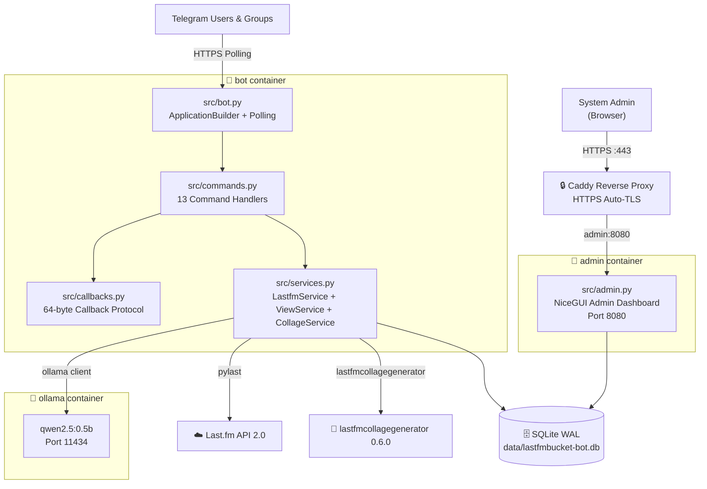

# 🎵 lastfmbucket-bot

> A Telegram bot that turns your Last.fm listening history into rich music insights — powered by AI.

[](https://www.python.org/)
[](https://python-telegram-bot.org/)
[](https://www.last.fm/api)
[](https://ollama.com/)
[](https://nicegui.io/)
[](https://sqlite.org/)
[](https://docs.docker.com/compose/)
[](LICENSE)

---

## What is it?

**lastfmbucket-bot** is a self-hosted Telegram bot that bridges your [Last.fm](https://last.fm) music scrobble history with the power of Telegram group chats and local AI inference. It lets you and your friends share what you're listening to, compare music tastes, explore listening charts, and get AI-generated commentary on your musical identity — all from within Telegram.

It ships with a **web-based administration panel** (NiceGUI) and is designed to be deployed on a personal VPS behind a Caddy reverse proxy.

---

## Features

| Category | Feature | Command |
|----------|---------|---------|
| 🎵 **Now Playing** | Show currently playing track with album art | `/np` |
| 📋 **Recent Tracks** | View last 5 scrobbled tracks with timestamps | `/status` |
| 🏆 **Top Charts** | Interactive top artists / albums / tracks across 6 time periods | `/tops` |
| 🎨 **Collage** | Visual composite image grids (1x1 up to 20x20, max 400 tiles) with dynamic resolution scaling | `/collage [size: 3x3|10x10] [period] [entity] [tile_size: 150px]` |
| 👥 **Comparison** | Compare your taste with another Last.fm user | `/compare <username>` |
| 🤖 **AI Vibe** | AI mood analysis of your recent listening | `/vibe` |
| 🔥 **AI Roast** | Humorous AI critique of your music taste | `/roast` |
| 💡 **AI Recommendations** | AI-powered discovery of similar lesser-known artists | `/recommend` |
| ⚙️ **Account Setup** | Link your Last.fm username | `/set <username>` |
| 🔧 **Preferences** | View settings and unlink account | `/preferences` |
| 🔒 **Privacy** | View the data privacy policy | `/privacy` |
| ❓ **Help** | Get the bot description and command list | `/help` |
| 📝 **Changelog** | View the latest release notes | `/changelog` |
| 👋 **Start** | Welcome message and onboarding prompt | `/start` |

---

## Architecture Overview



For a complete technical deep-dive, see [ARCHITECTURE.md](ARCHITECTURE.md).  
For the product overview and user journey, see [docs/PRODUCT_PRESENTATION.md](docs/PRODUCT_PRESENTATION.md).

---

## Tech Stack

| Component | Technology | Version |
|-----------|-----------|---------|
| Language | Python | ≥ 3.14 |
| Package Manager | [uv](https://docs.astral.sh/uv/) (Astral) | latest |
| Bot Framework | python-telegram-bot | 22.8 |
| Last.fm API | pylast | 7.0.0 |
| Collage Generator | [lastfmcollagegenerator](https://pypi.org/project/lastfmcollagegenerator/) | 0.6.0 |
| Database ORM | Peewee | 3.18.3 |
| Database | SQLite (WAL mode) | — |
| AI / LLM | Ollama + qwen2.5:0.5b | ≥ 0.4.0 |
| Admin UI | NiceGUI | ≥ 2.0.0 |
| Error Tracking | Sentry SDK | 2.48.0 |
| Linter | Ruff | 0.14.10 |
| Reverse Proxy | Caddy | 2.x |
| Container Runtime | Docker + Compose | — |

---

## Quickstart

### Prerequisites

- Python ≥ 3.14
- [uv](https://docs.astral.sh/uv/) installed
- A [Telegram Bot Token](https://core.telegram.org/bots#botfather) (from @BotFather)
- A [Last.fm API Key & Secret](https://www.last.fm/api/account/create)

### 1. Clone & Configure

```bash
git clone https://github.com/paurieraf/lastfmbucket-bot.git
cd lastfmbucket-bot

# Copy the template and fill in your credentials
cp .env.template .env
```

Edit `.env`:

```dotenv
DB_SQLITE_NAME=data/lastfmbucket-bot.db

# Telegram
TELEGRAM_BOT_TOKEN=your_bot_token_here

# Last.fm
LASTFM_API_KEY=your_lastfm_api_key
LASTFM_API_SECRET=your_lastfm_api_secret

# Admin Dashboard
ADMIN_USERNAME=admin
ADMIN_PASSWORD=a_strong_password
ADMIN_SECRET_KEY=a_random_32_char_hex_string

# Optional: Sentry error tracking
SENTRY_DSN=
```

### 2. Run Locally (Development)

```bash
# Install dependencies
uv sync

# Create the data directory
mkdir -p data

# Run the bot
uv run python src/bot.py

# In a separate terminal, run the admin dashboard
uv run python src/admin.py
```

The admin panel is available at `http://localhost:5000`.

### 3. Run with Docker Compose (Recommended for Production)

```bash
# Build and start all services (bot + admin + ollama)
docker compose up -d

# View logs
docker compose logs -f bot
docker compose logs -f admin
```

> **Note:** On first run, the Ollama container will pull the `qwen2.5:0.5b` model (~400MB). AI commands (`/vibe`, `/roast`, `/recommend`) will be temporarily unavailable until the download completes.

---

## Configuration Reference

| Variable | Required | Description | Default |
|----------|----------|-------------|---------|
| `DB_SQLITE_NAME` | ✅ | Path to SQLite database file | — |
| `TELEGRAM_BOT_TOKEN` | ✅ | Bot token from @BotFather | — |
| `LASTFM_API_KEY` | ✅ | Last.fm API consumer key | — |
| `LASTFM_API_SECRET` | ✅ | Last.fm API consumer secret | — |
| `ADMIN_USERNAME` | ⚠️ | Admin panel login username | `admin` |
| `ADMIN_PASSWORD` | ⚠️ | Admin panel login password | `changeme` |
| `ADMIN_SECRET_KEY` | ⚠️ | Session encryption key (32+ char random string) | ephemeral |
| `ADMIN_PORT` | — | Admin panel port | `5000` (local), `8080` (Docker) |
| `OLLAMA_HOST` | — | Ollama server URL | `http://ollama:11434` |
| `SENTRY_DSN` | — | Sentry error reporting DSN | — |

---

## Command Cheatsheet

```
/start              — Welcome message & onboarding
/set <username>     — Link your Last.fm account
/np                 — Now playing track (+ album art button)
/status             — Last 5 scrobbles with timestamps
/tops               — Interactive top charts (Artists/Albums/Tracks × 6 periods)
/tops artists week  — Direct shortcut: top artists this week
/collage            — Visual collage grid (interactive or e.g. /collage 5x5 overall artist)
/compare <user>     — Compare your taste with another Last.fm user
/vibe               — AI mood analysis of your recent listening
/roast              — AI humorously critiques your music taste
/recommend          — AI suggests 5 lesser-known artists you might love
/preferences        — Account settings & unlink option
/privacy            — Data privacy policy
/help               — Bot description & command overview
/changelog          — Latest release notes
```

---

## Deployment with Caddy (Production)

The included `Caddyfile` configures Caddy to proxy HTTPS traffic to the admin container:

```
lastfmbucketbot-admin.musicbucket.net {
    reverse_proxy admin:8080
}
```

The admin container joins the `navidrome-orchestra_caddy-with-admin` external Docker network, allowing Caddy (defined in a separate stack) to route traffic to it.

See [`Caddyfile`](Caddyfile) and [`docker-compose.yml`](docker-compose.yml) for full details.

---

## Project Structure

```
lastfmbucket-bot/
├── src/
│   ├── bot.py          # Bot entrypoint: ApplicationBuilder, handler registration
│   ├── commands.py     # 13 command handlers + callback router
│   ├── callbacks.py    # 64-byte compact callback query protocol
│   ├── services.py     # LastfmService (domain) + ViewService (presentation)
│   ├── lastfm.py       # pylast client wrapper (LastfmClient)
│   ├── ai.py           # Ollama LLM client (vibe / roast / recommend)
│   ├── db.py           # Peewee ORM models + CRUD operations
│   ├── admin.py        # NiceGUI admin dashboard (5 routes)
│   ├── config.py       # Environment variable loading
│   └── responses.py    # HTML/text response templates
├── data/               # SQLite database volume (Docker-mounted)
├── docs/
│   └── PRODUCT_PRESENTATION.md  # Product overview & user journeys
├── ARCHITECTURE.md     # Full technical architecture specification
├── CHANGELOG.md        # Release history
├── Dockerfile          # Multi-stage Python 3.14 image
├── docker-compose.yml  # 3-service stack: bot, admin, ollama
├── Caddyfile           # HTTPS reverse proxy config
├── pyproject.toml      # Dependencies + Ruff linter config
└── .env.template       # Environment variable template
```

---

## Documentation

| Document | Description |
|----------|-------------|
| [README.md](README.md) | Project overview, quickstart, and reference (this file) |
| [ARCHITECTURE.md](ARCHITECTURE.md) | Full technical specification: components, data flows, DB schema, known bugs |
| [docs/PRODUCT_PRESENTATION.md](docs/PRODUCT_PRESENTATION.md) | Product vision, feature showcase, user journeys, and diagrams |
| [CHANGELOG.md](CHANGELOG.md) | Release history |

---

## License

This project is licensed under the [GNU General Public License v3.0](LICENSE).
