# 🎵 lastfmbucket-bot — Product Presentation

> *Your Last.fm listening history, reimagined for Telegram and supercharged with AI.*

---

## Table of Contents

1. [Product Vision](#1-product-vision)
2. [Who Is It For?](#2-who-is-it-for)
3. [Feature Showcase](#3-feature-showcase)
4. [User Journeys](#4-user-journeys)
5. [System at a Glance](#5-system-at-a-glance)
6. [AI Capabilities](#6-ai-capabilities)
7. [Admin & Operations](#7-admin--operations)
8. [Privacy & Data](#8-privacy--data)

---

## 1. Product Vision

**lastfmbucket-bot** transforms passive music scrobbling into an active, social experience inside Telegram.

Most people who use Last.fm treat it as a silent ledger — data collected, rarely surfaced. This bot inverts that: it meets listeners where they already spend their time (Telegram), pipes in their live scrobble history, and layers on **AI-generated personality insights** that make music taste feel personal and expressive.

It's designed to be self-hosted, privacy-first, and free from external AI API costs — running entirely with a local LLM (Ollama + qwen2.5:0.5b).

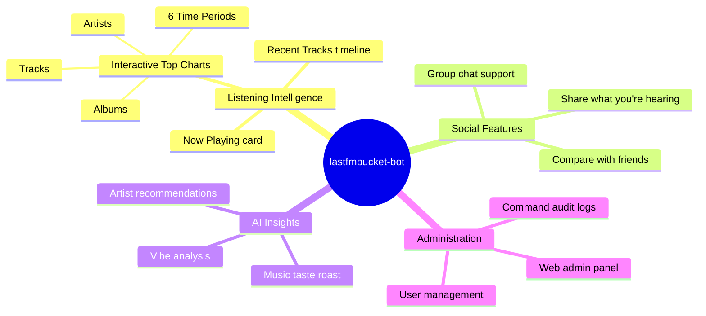

---

## 2. Who Is It For?

| Persona | How They Use It |
|---------|----------------|
| 🎧 **Music Enthusiasts** | Share now-playing cards in group chats; explore personal taste trends |
| 👥 **Friend Groups** | Compare listening habits; discover shared artists |
| 🎵 **Last.fm Power Users** | Surface their scrobble data directly in the messenger they already use |
| 🤖 **AI-Curious Users** | Get playful AI commentary on their musical identity — no cloud API needed |
| 🖥️ **Self-Hosters** | Deploy on a VPS with full control over their data |

---

## 3. Feature Showcase

### 3.1 Now Playing — `/np`

The flagship command. Fetches the user's currently scrobbling track from Last.fm in real time and renders a rich message card.

**What you get:**
- Track title, artist, and album name
- An interactive **"More info"** button that expands to the last 5 tracks
- An **album cover art** button that replaces the text card with a full photo

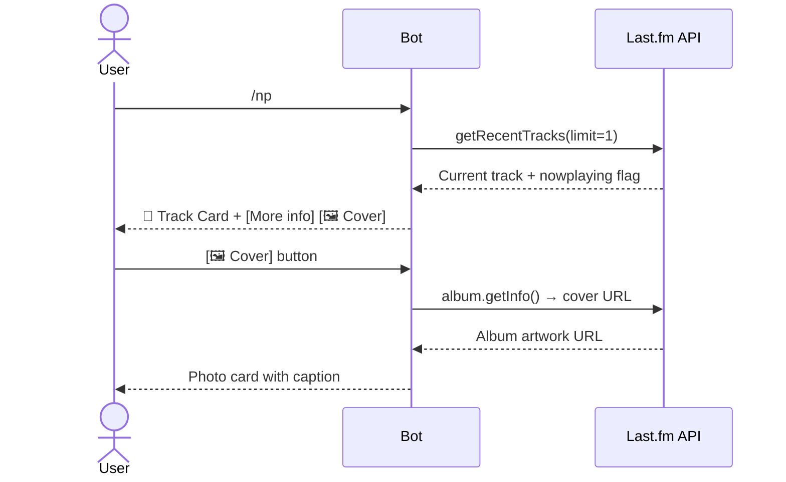

---

### 3.2 Recent Tracks — `/status`

Shows the last 5 scrobbled tracks with **human-readable relative timestamps** ("3 minutes ago", "yesterday"). Clicking the **"Less info"** button collapses back to the compact Now Playing view.

---

### 3.3 Interactive Top Charts — `/tops`

The most interactive feature. A multi-step inline keyboard navigation:

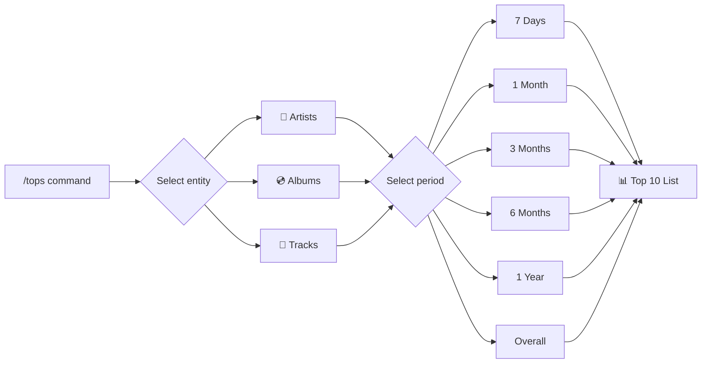

You can also skip the menus with a direct command:
```
/tops artists week
/tops albums month
/tops tracks overall
```

**Group chat safety:** The 64-byte callback payload always encodes the *owner's* Telegram ID, ensuring that other group members pressing your buttons only refresh *your* data — not their own.

---

### 3.4 Visual Collage Generation — `/collage`

Generates high-resolution composite image cards of your top albums, artists, or tracks:

- **Configurable Dimensions:** Supports arbitrary NxM grids from 1x1 up to **20x20** (maximum 400 tiles).
- **Dynamic Resolution Scaling:** Automatically scales tile resolutions (300px, 150px, 100px) and font typography proportionally for crystal-clear visual quality without excessive memory usage.
- **Custom Tile Sizing:** Optionally specify explicit tile sizes (e.g. `150px`, `ts:200`) between 50px and 600px.
- **Interactive Multi-Tier Builder or CLI Shortcuts:**
  ```
  /collage                         # Launches interactive 3-step button builder
  /collage 3x3 week album          # Direct 3x3 weekly album collage
  /collage 10x10 overall artist    # Massive 100-artist all-time collage
  /collage 5x5 1month track 150px  # 25-track monthly collage with custom 150px tiles
  ```

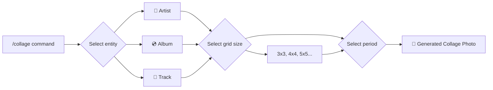

---

### 3.5 User Comparison — `/compare <lastfm_username>`

Compare your listening stats head-to-head with any Last.fm user:

- **Scrobble count** for each user
- **Top 5 artists** side-by-side
- **Common artists** — artists you both love, with each person's play counts

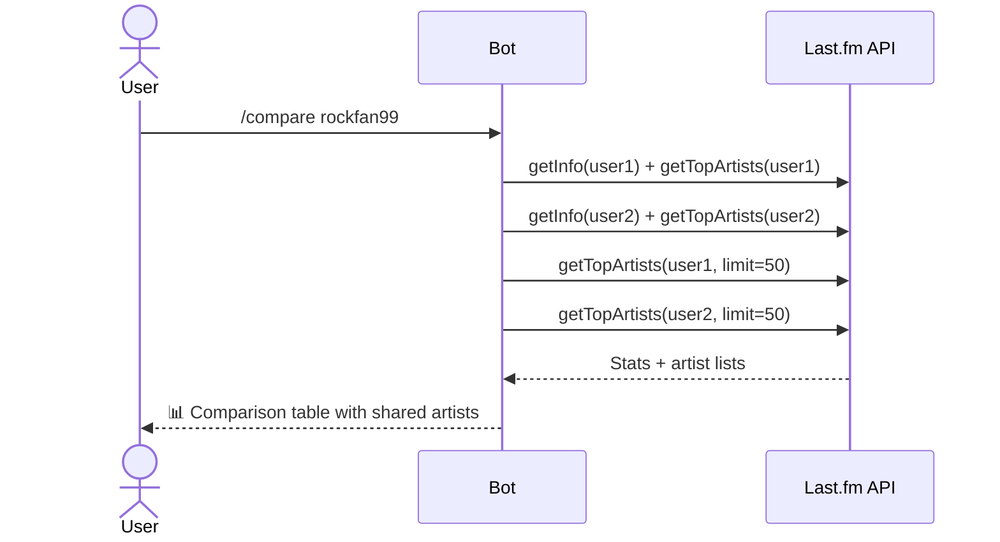

---

### 3.5 Preferences — `/preferences`

Shows the user's linked Last.fm account and provides an **Unlink account** inline button that removes the Telegram ↔ Last.fm mapping from the database with a single tap.

---

## 4. User Journeys

### 4.1 Onboarding Flow

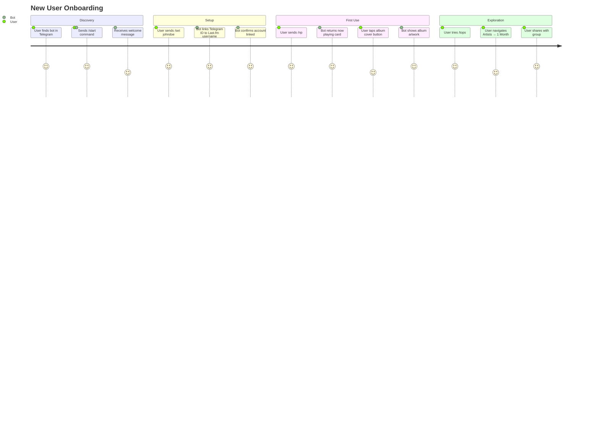

### 4.2 Social Group Chat Flow

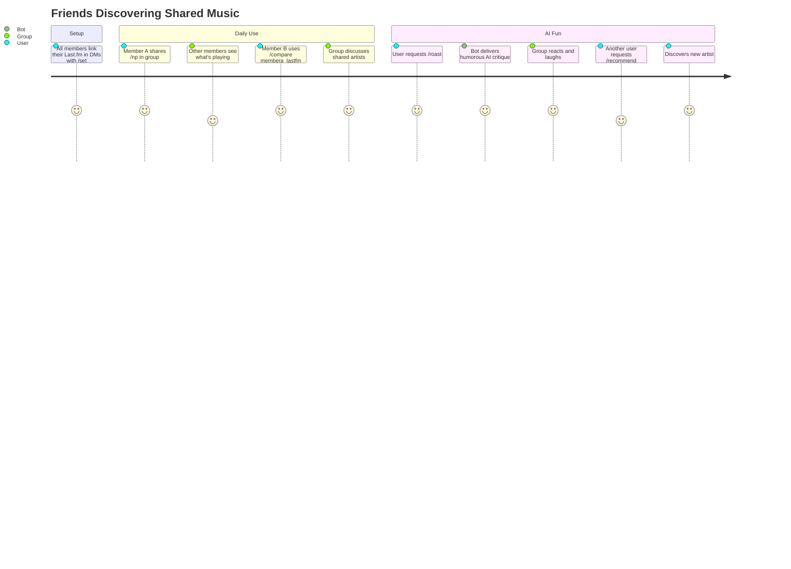

---

## 5. System at a Glance

### Component Map

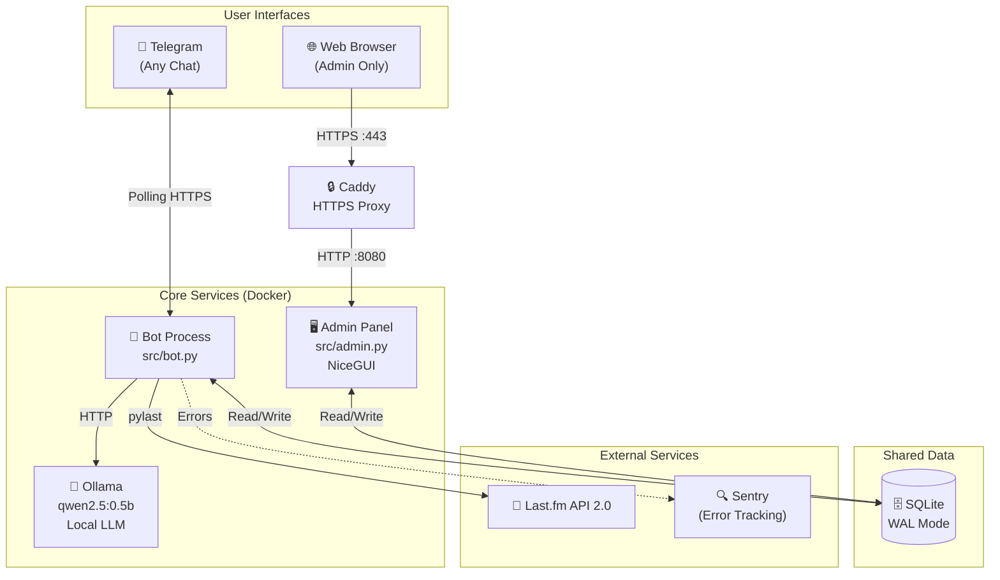

### Data Model

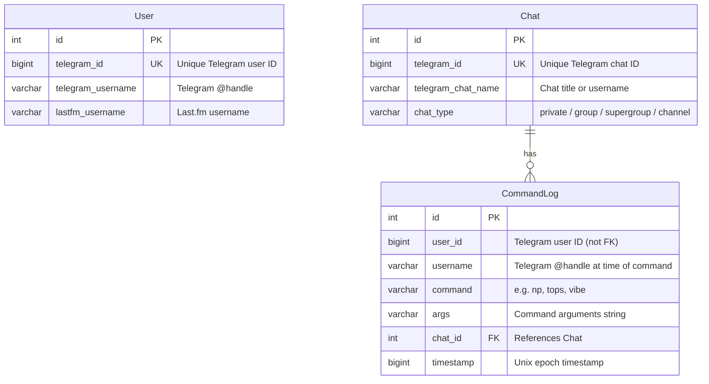

---

## 6. AI Capabilities

All AI features run **100% locally** using [Ollama](https://ollama.com/) and the `qwen2.5:0.5b` model — a 400MB ultra-compact model chosen to operate within a 2GB RAM container.

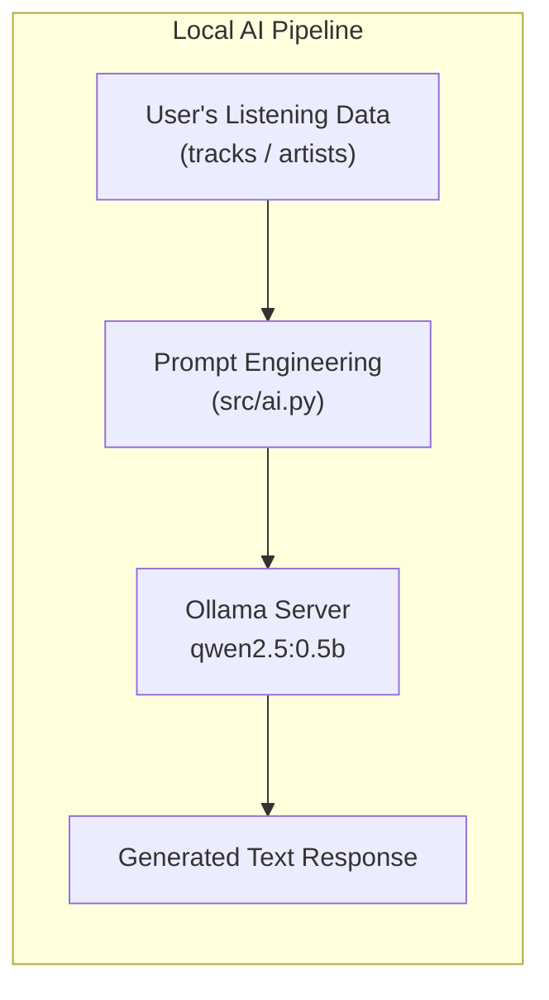

### AI Feature Details

| Command | Input Data | Prompt Goal | Temperature | Max Tokens |
|---------|-----------|-------------|-------------|------------|
| `/vibe` | Last 10 scrobbles + current track | Mood/atmosphere description in 2-3 sentences with emojis | 0.8 | 100 |
| `/roast` | Top 10 artists + top 5 tracks (all-time) | Witty, humorous critique in 2-3 sentences | 0.9 | 120 |
| `/recommend` | Top 10 artists (all-time) | 5 lesser-known similar artists with brief rationale | 0.7 | 150 |

**Fallback behavior:** If Ollama is unreachable or model inference fails, all AI commands return a friendly error message rather than crashing.

**Model auto-provisioning:** On first AI command invocation, the bot automatically pulls `qwen2.5:0.5b` if it isn't already present in the Ollama volume.

---

## 7. Admin & Operations

The **NiceGUI Admin Dashboard** provides a web UI for monitoring and managing the bot's data.

### Admin Routes

| Route | Description |
|-------|-------------|
| `/login` | Credential-based login (username + password from env vars) |
| `/` | **Dashboard** — Total users, chats, commands, and today's activity |
| `/users` | **User management** — List all linked users, delete accounts |
| `/chats` | **Chat registry** — All known Telegram chats (private, group, channel) |
| `/logs` | **Command audit log** — Filterable history of all bot commands |

### Deployment Topology

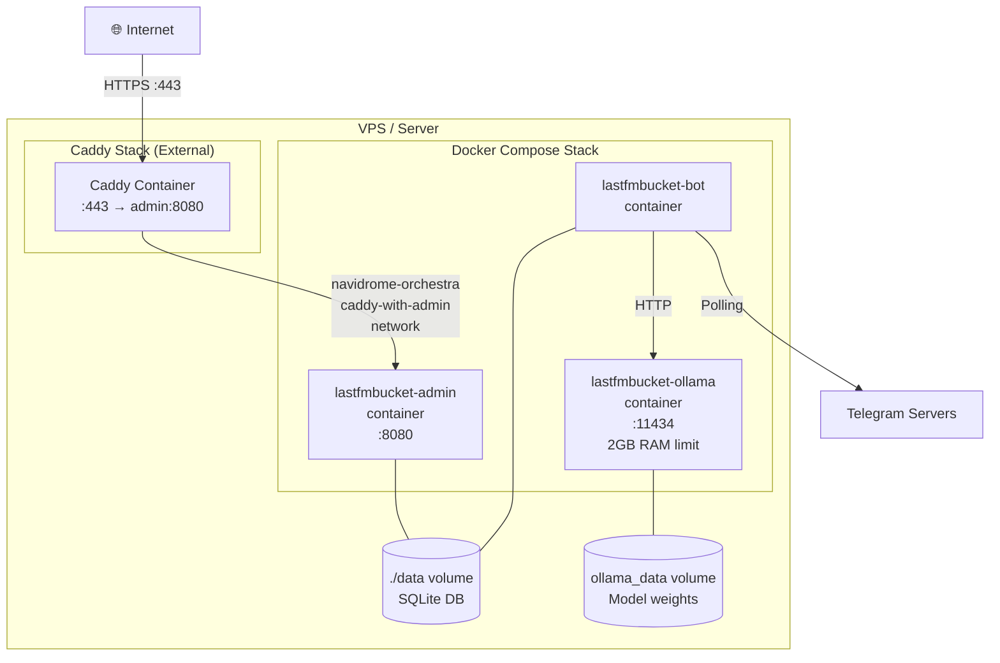

### CI/CD Pipeline

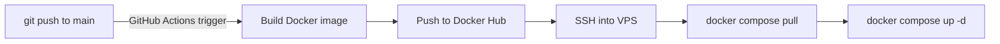

---

## 8. Privacy & Data

- **What is stored:** Telegram user ID, Telegram @username, and Last.fm username. Command execution logs (command name, args, chat context, timestamp).
- **What is NOT stored:** Message content, passwords, audio data, or any media.
- **Data access:** Only accessible via the admin panel (password-protected) or direct database file access on the host.
- **Right to erasure:** Users can delete their own account data at any time via `/preferences` → Unlink account.
- **Last.fm data:** All Last.fm queries use public API endpoints and read-only consumer keys. No user authentication tokens are stored.

---

*For technical implementation details, see [ARCHITECTURE.md](../ARCHITECTURE.md).*  
*For the project overview and repository guide, see [README.md](../README.md).*
