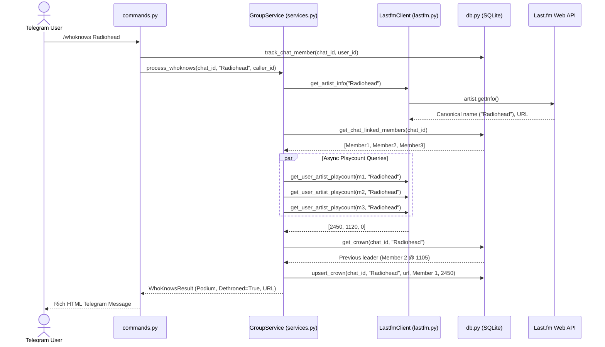

# Design: Group WhoKnows & Crowns System

## Architecture Overview

The WhoKnows and Crowns system enables group-level music competition in Telegram. It relies on:
1. **Dynamic Group Membership Tracking**: Auto-discovering members in `ChatMember` on every command or message.
2. **Canonical Artist Resolution & Concurrency**: Using `pylast` via worker threads to fetch canonical names, Last.fm URLs, and concurrent user playcounts (`asyncio.gather` with `asyncio.to_thread`).
3. **Crown State Engine**: Updating `Crown` records in SQLite, detecting leader transitions (dethronements), and compiling Hall of Fame leaderboards.



## Database Schema Additions (`src/db.py`)

### Model `ChatMember`
```python
class ChatMember(Model):
    chat = ForeignKeyField(Chat, backref="members", on_delete="CASCADE")
    user = ForeignKeyField(User, backref="chat_memberships", on_delete="CASCADE")
    last_active = BigIntegerField()  # Unix epoch timestamp
    opt_out = BooleanField(default=False)

    class Meta:
        database = db
        indexes = (
            (("chat", "user"), True),  # Unique composite index
        )
```

### Model `Crown`
```python
class Crown(Model):
    chat = ForeignKeyField(Chat, backref="crowns", on_delete="CASCADE")
    artist_name = CharField(index=True)
    artist_url = CharField(default="")
    user = ForeignKeyField(User, backref="crowns", on_delete="CASCADE")
    playcount = BigIntegerField(default=0)
    updated_at = BigIntegerField()  # Unix epoch timestamp

    class Meta:
        database = db
        indexes = (
            (("chat", "artist_name"), True),  # One crown per artist per chat
        )
```

## Last.fm Client Additions (`src/lastfm.py`)

1. **`get_artist_canonical_info(artist_name: str) -> tuple[str, str] | None`**:
   - Fetches `pylast.Artist(artist_name, self.client)`.
   - Obtains official `name = artist.get_name()` and `url = artist.get_url()`.
   - Returns `(canonical_name, url)` or `None` if artist is not found.
2. **`get_user_artist_playcount(username: str, artist_name: str) -> int`**:
   - Calls `pylast.Artist(artist_name, self.client, username=username).get_userplaycount()`.
   - Safely parses and returns `int(count or 0)`.

## GroupService & ViewService (`src/services.py`)

1. **`GroupService.get_whoknows_ranking(chat_id, artist_input, caller_user_id)`**:
   - Resolves artist name (direct argument, replied message, or caller's `/np`).
   - Fetches canonical artist info and URL.
   - Retrieves active members for `chat_id` who are linked to Last.fm and have `opt_out=False`.
   - Uses `asyncio.gather` + `asyncio.to_thread` for concurrent Last.fm playcount queries.
   - Filters out users with `playcount == 0`.
   - Checks existing `Crown` for `(chat_id, canonical_name)` to determine if a dethronement occurred (`prev_user != new_top_user`).
   - Updates/Creates `Crown` in SQLite.
   - Formats the response using HTML templates in `responses.py`.
2. **`GroupService.get_crowns_leaderboard(chat_id)`**:
   - Aggregates crown counts per user in the chat: `Crown.select(Crown.user, fn.COUNT(Crown.id).alias('crown_count')).where(Crown.chat == chat).group_by(Crown.user).order_by(SQL('crown_count DESC'))`.
   - Returns top crown holders with sample artists.
3. **`GroupService.get_user_crowns(chat_id, telegram_id_or_username)`**:
   - Returns all `Crown` rows for that user in the specified chat, sorted by `playcount DESC`.

## Callback Protocol Extensions (`src/callbacks.py`)

- Add `Action.WHOKNOWS = "wk"` to compact 64-byte protocol.
- Inline button on `/np` card: `1|wk|owner_id||` to trigger `/whoknows` for the currently playing artist.
